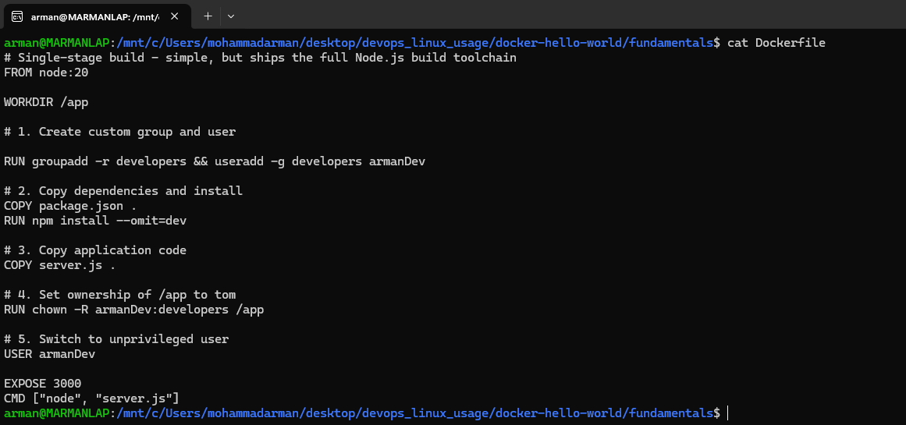
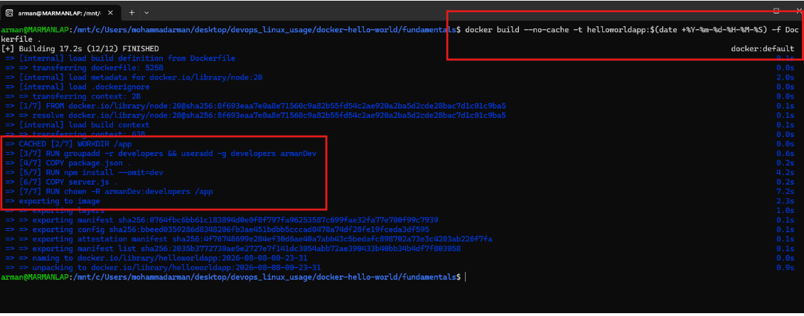
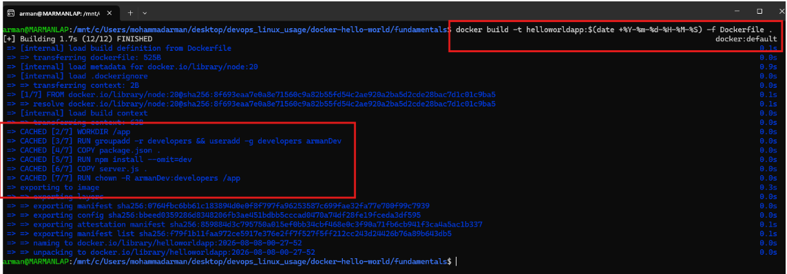
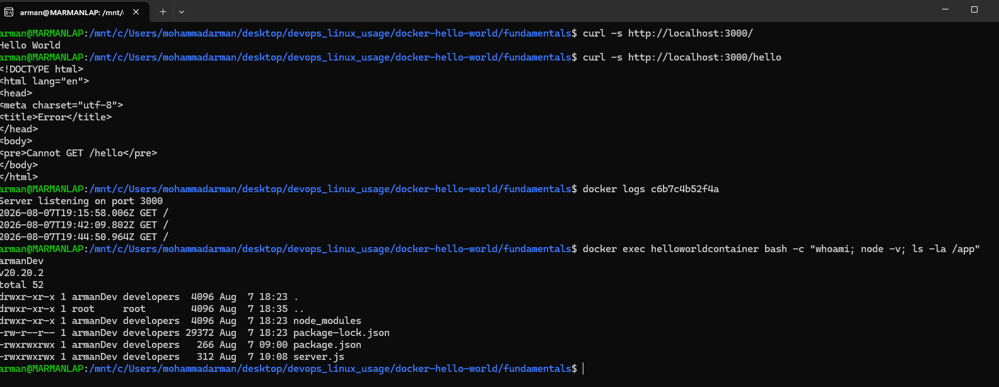
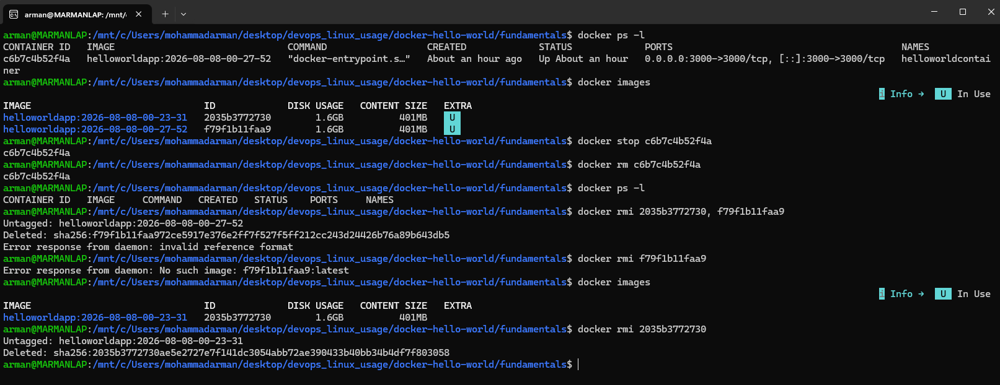
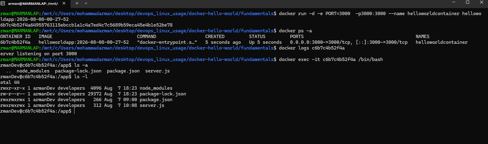
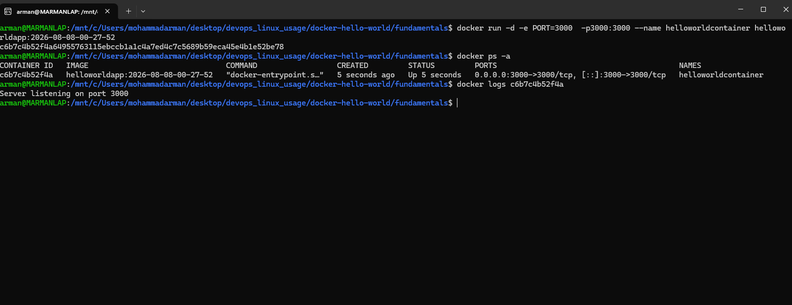

# Docker Fundamentals — Hello World

A tiny Express app used to practice Docker: build, cache behavior, run,
logs, exec, permissions, and cleanup. Screenshots below are the actual
terminal output captured while running each step.

## Files

- `server.js` — the app, responds "Hello World" on `/`.
- `package.json` — the one dependency (`express`).
- `Dockerfile` — single-stage build, runs as a non-root user.
- `Dockerfile.multistage` — multi-stage build (smaller image).

## Steps

### 1. The Dockerfile

```bash
cat Dockerfile
```

`FROM node:20` → `WORKDIR /app` → create a non-root user (`groupadd
developers`, `useradd armanDev`) → copy `package.json` and `npm install`
→ copy `server.js` → `chown` the app folder to that user → `USER
armanDev` so the container never runs as root → `EXPOSE 3000` →
`CMD ["node", "server.js"]`.



### 2. Build with `--no-cache`

```bash
docker build --no-cache -t helloworldapp:$(date +%Y-%m-%d-%H-%M-%S) -f Dockerfile .
```

Only `WORKDIR /app` shows `CACHED` — it has no real inputs (no file
copy, no command output), so Docker treats it as free and reuses it
even with `--no-cache`. Every other step (`groupadd`/`useradd`, `COPY`,
`npm install`, `chown`) rebuilds from scratch.



### 3. Build again, cache on

Instructions like RUN, COPY, and ADD execute shell commands or read files from your host machine. Because their outputs can change, --no-cache forces Docker to re-run them from scratch.

WORKDIR /app, however, is purely a configuration / metadata instruction (similar to EXPOSE or ENV). It simply sets internal pointer attributes in the container configuration. Because setting a working directory path has no external dependencies, BuildKit resolves its metadata evaluation instantly without creating new layer diffs.

```bash
docker build -t helloworldapp:$(date +%Y-%m-%d-%H-%M-%S) -f Dockerfile .
```

Same Dockerfile, no `--no-cache` this time, nothing changed on disk →
every layer shows `CACHED`, build finishes in ~1.7s instead of ~17s.



### 4. Run, list, check logs

```bash
docker run -d -e PORT=3000 -p3000:3000 --name helloworldcontainer helloworldapp:<tag>
docker ps -a
docker logs <container_id>
```

Starts the container in the background, maps port 3000, and confirms
the app logged its startup message.



### 5. Exec in and check file ownership

```bash
docker exec -it <container_id> /bin/bash
ls -a
ls -l
```

Inside the container: files under `/app` are owned by `armanDev` (not
`root`) — proof the `chown` + `USER armanDev` lines in the Dockerfile
actually took effect.



### 6. Test the app and inspect further

```bash
curl -s http://localhost:3000/
curl -s http://localhost:3000/hello
docker logs <container_id>
docker exec helloworldcontainer bash -c "whoami; node -v; ls -la /app"
```

`/` returns "Hello World"; an undefined route (`/hello`) correctly
404s, proving Express routing (not a static response). `whoami` confirms
the running process is `armanDev`, not `root`.



### 7. Clean up

```bash
docker ps -l
docker images
docker stop <container_id>
docker rm <container_id>
docker rmi <image_id>
```

Stops and removes the container, then removes the built images. Note:
`docker rmi` needs a valid image reference — a trailing comma or an
already-removed tag throws "invalid reference format" / "No such image".


