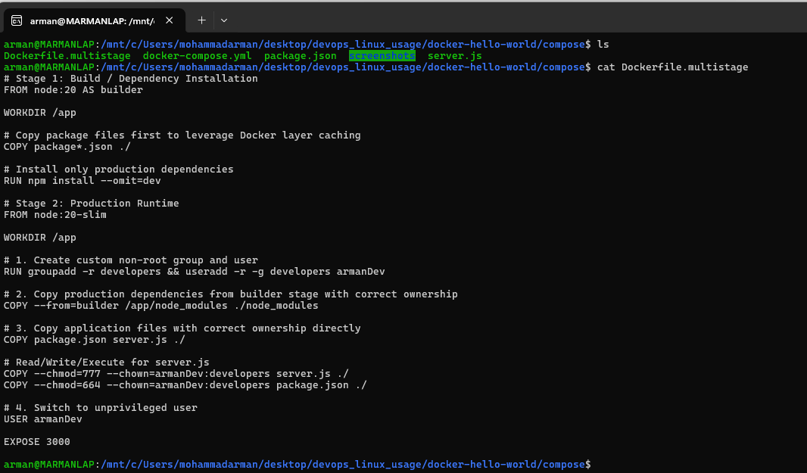
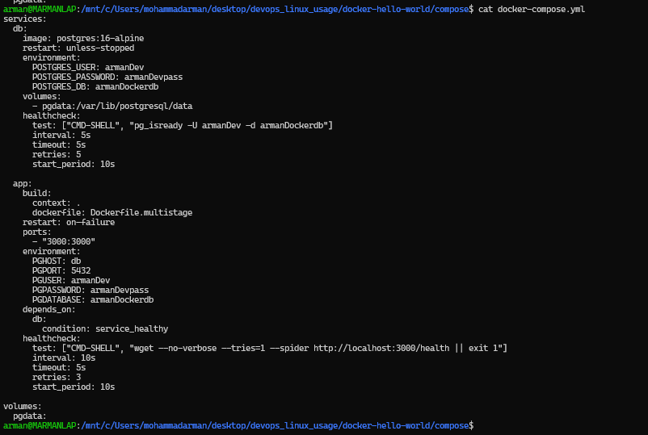
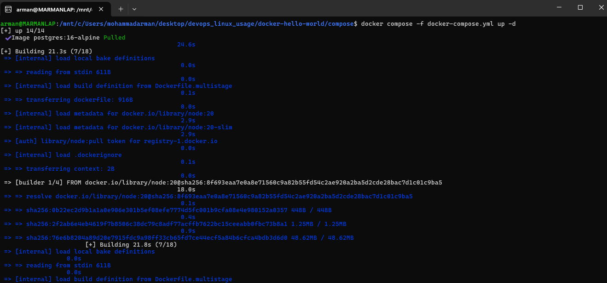
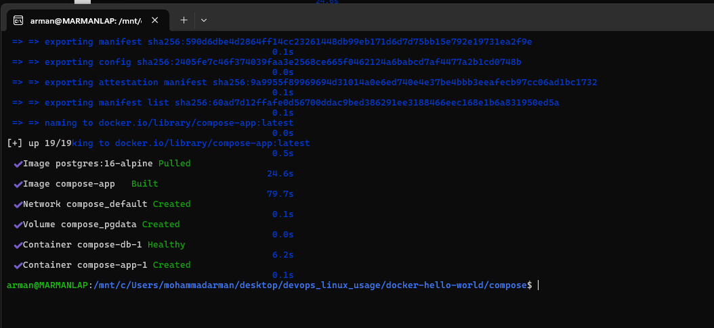
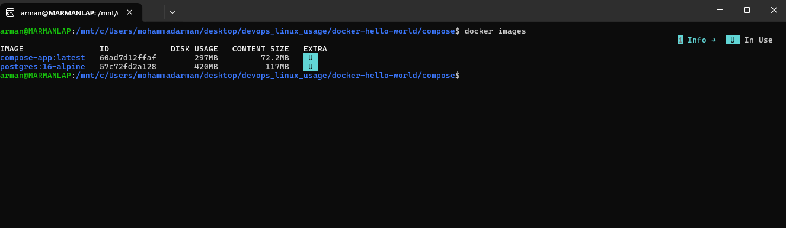
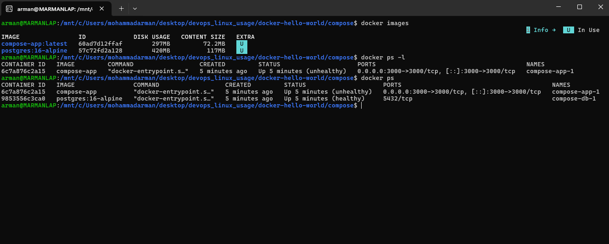
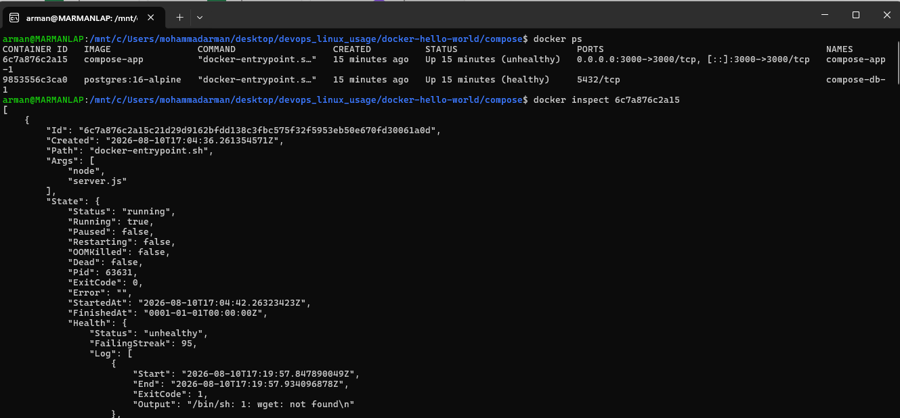
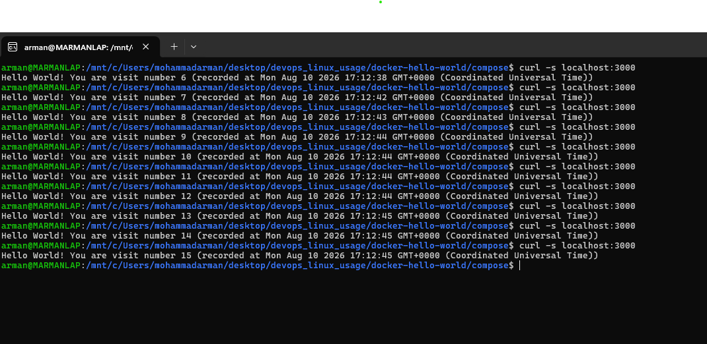
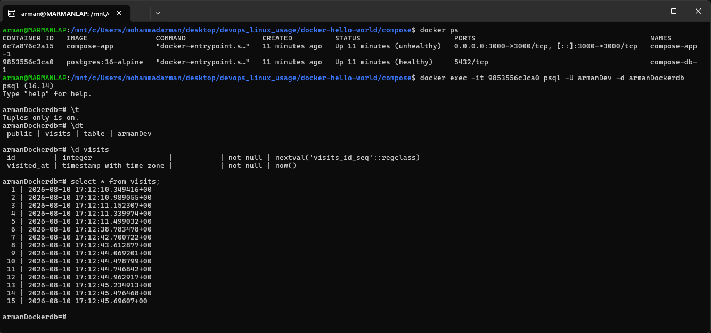

# Docker Compose — App + Postgres

A Node/Express app and Postgres 16 brought up together with Compose:
multi-stage build, healthchecks, named volume, and service networking.
Screenshots below are the actual terminal output captured while running
each step.

## Files

- `server.js` — Express app; writes a visit row on `/`, exposes `/health`.
- `package.json` — dependencies (`express`, `pg`).
- `Dockerfile.multistage` — multi-stage build, runs as a non-root user.
- `docker-compose.yml` — `db` + `app` services, volume, healthchecks.

## Steps

### 1. The multi-stage Dockerfile

```bash
ls
cat Dockerfile.multistage
```

Stage 1 (`node:20 AS builder`): copy `package*.json`, `npm install
--omit=dev`. Stage 2 (`node:20-slim`): create non-root user `armanDev`,
copy `node_modules` from the builder, copy `server.js` / `package.json`
with ownership set, `USER armanDev`, `EXPOSE 3000`, run `node
server.js`.



### 2. The compose file

```bash
cat docker-compose.yml
```

`db` pulls `postgres:16-alpine`, sets credentials / DB name, mounts
named volume `pgdata`, and healthchecks with `pg_isready`. `app` builds
from `Dockerfile.multistage`, maps `3000:3000`, points `PGHOST` at the
service name `db`, and `depends_on` with `condition: service_healthy`
so the app only starts after Postgres is ready.



### 3. Compose up — pull and build

```bash
docker compose -f docker-compose.yml up -d
```

Compose pulls `postgres:16-alpine`, then starts building `compose-app`
from the multi-stage Dockerfile (base images `node:20` and
`node:20-slim`, context transfer, layer downloads).



### 4. Compose up — services ready

Build finishes and Compose creates the shared network, the `pgdata`
volume, waits until `compose-db-1` is healthy, then creates
`compose-app-1`. Detached (`-d`) returns you to the shell when everything
is up.



### 5. List the images

```bash
docker images
```

Two images in use: `compose-app:latest` (the multi-stage build) and
`postgres:16-alpine` (pulled for the `db` service). The `U` marker means
a running container is using that image.



### 6. List the containers

```bash
docker images
docker ps -l
docker ps
```

Both containers are running: `compose-db-1` is `healthy`, port 5432
internal only; `compose-app-1` is mapped to host `3000` but reports
`unhealthy` — next step digs into why.



### 7. Inspect the unhealthy app (and fix)

```bash
docker ps
docker inspect <app_container_id>
```

`State.Health` shows `unhealthy` with a high failing streak. The health
log output is `/bin/sh: 1: wget: not found` — the original compose
healthcheck used `wget` against `/health`, but `node:20-slim` does not
ship `wget`, so the check always exited 1 even though the app itself was
running.

That could be fixed by installing `wget` in the image. Instead, the
healthcheck was switched to Node (already present in the image), which
GETs `http://localhost:3000/health` and exits non-zero if the status is
not 200:

```yaml
healthcheck:
  test: ["CMD", "node", "-e", "require('http').get('http://localhost:3000/health', (r) => { if (r.statusCode !== 200) process.exit(1); })"]
  interval: 10s
  timeout: 5s
  retries: 3
  start_period: 10s
```



### 8. Hit the app over the published port

```bash
curl -s localhost:3000
```

Repeated curls return an incrementing visit counter (`visit number 6` …
`15`). That proves the host → app port mapping works and that each
request reaches Postgres over the Compose network (`PGHOST=db`).



### 9. Confirm rows in Postgres

```bash
docker ps
docker exec -it <db_container_id> psql -U armanDev -d armanDockerdb
```

Inside `psql`: `\dt` shows the `visits` table owned by `armanDev`;
`\d visits` shows `id` (serial) and `visited_at` (timestamptz);
`SELECT * FROM visits;` returns the same 15 rows the curls recorded.


