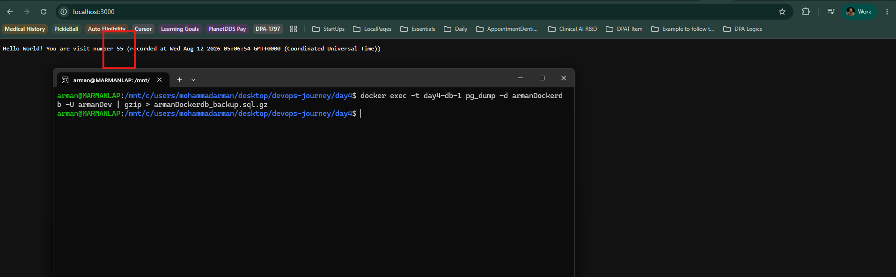
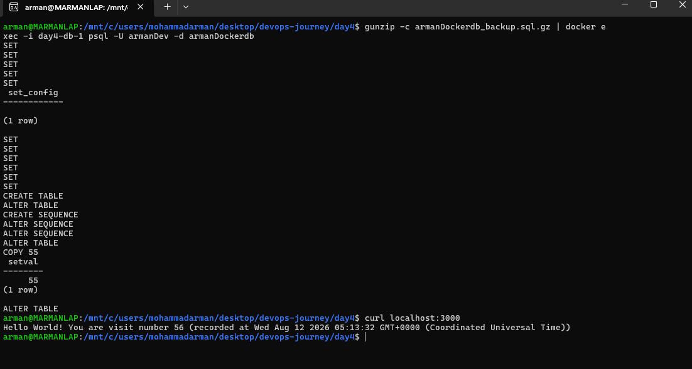

# Docker Compose — Secrets, pgAdmin, and Migrations

Follow-on work on the same Compose stack: credentials moved into a
`.env` file so secrets stay out of `docker-compose.yml`, a `pgadmin`
service for a Postgres UI, and a `pg_dump` backup / restore path for
database migrations. Screenshots below are the actual terminal output
captured while running each step.

## Files

- `.env` — local secrets (`POSTGRES_*`, `PGADMIN_*`); gitignored, not
  committed.
- `.env.example` — empty placeholders documenting the required keys.
- `docker-compose.yml` — `db`, `app`, and `pgadmin`; credentials via
  `${…}` interpolation.
- `armanDockerdb_backup.sql.gz` — compressed dump produced by
  `pg_dump` for migration / restore.

## Steps

### 1. Keep secrets out of Compose with `.env`

```bash
cat .env.example
cat docker-compose.yml
```

`docker-compose.yml` no longer hardcodes passwords or DB names. The
`db` and `app` services read `POSTGRES_USER`, `POSTGRES_PASSWORD`, and
`POSTGRES_DB` from the environment; Compose loads those from a local
`.env` next to the compose file. `.env.example` lists the same keys
with empty values so others know what to fill in without seeing real
credentials. `.env` itself is listed in `.gitignore`, so secrets stay
on the machine and never land in the repo.

### 2. Add pgAdmin for Postgres UI interactions

```bash
cat docker-compose.yml
docker compose -f docker-compose.yml up -d
```

A third service, `pgadmin`, uses `dpage/pgadmin4`, maps host `5050` to
container `80`, and takes `PGADMIN_DEFAULT_EMAIL` /
`PGADMIN_DEFAULT_PASSWORD` from the same `.env` pattern. It
`depends_on` `db` with `condition: service_healthy`, so the UI only
starts after Postgres is ready. Open `http://localhost:5050`, sign in
with the pgAdmin credentials from `.env`, then register a server whose
host is the Compose service name `db` (port `5432`) using the
`POSTGRES_*` user and password.

### 3. Dump the database with `pg_dump`

```bash
curl -s localhost:3000
docker exec -t day4-db-1 pg_dump -d armanDockerdb -U armanDev | gzip > armanDockerdb_backup.sql.gz
```

With the app recording visits (here, visit number 55), `pg_dump` runs
inside the running `day4-db-1` container against `armanDockerdb` as
`armanDev`. The SQL stream is piped through `gzip` into
`armanDockerdb_backup.sql.gz` on the host — a portable backup ready for
migration or restore.



### 4. Restore the dump after clearing data

```bash
gunzip -c armanDockerdb_backup.sql.gz | docker exec -i day4-db-1 psql -U armanDev -d armanDockerdb
curl localhost:3000
```

After the data was removed from Postgres, the compressed dump is
streamed back in: `gunzip -c` decompresses on the host, and `psql`
inside `day4-db-1` recreates the schema and loads the rows (`COPY 55`
for the `visits` table, plus sequence `setval`). A fresh
`curl localhost:3000` then returns visit number 56 — the restored 55
rows plus one new visit — confirming the migration round-trip worked.


