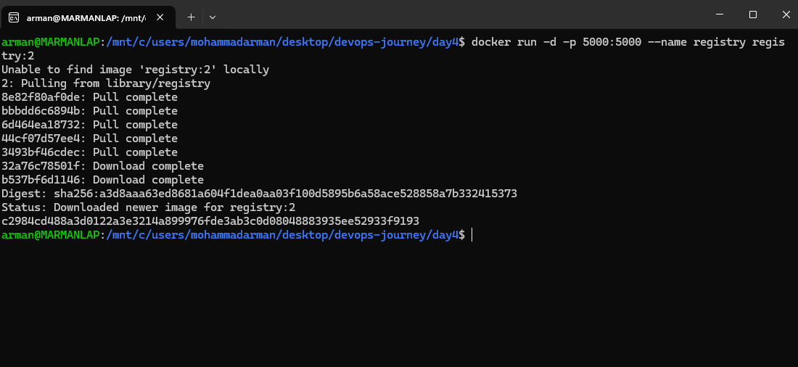
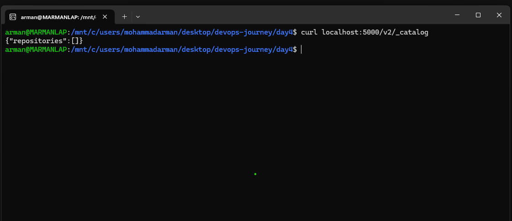
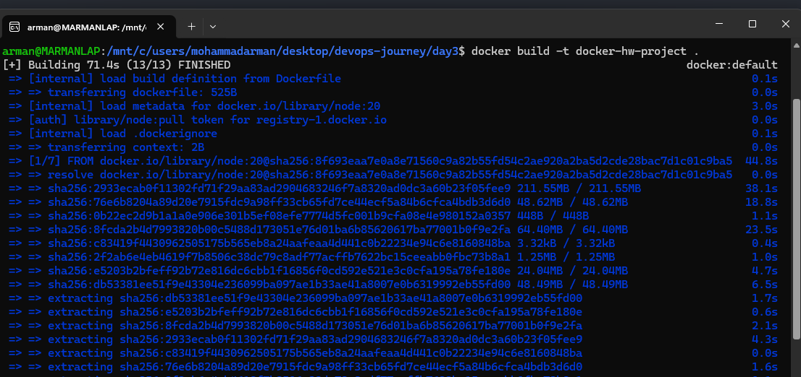
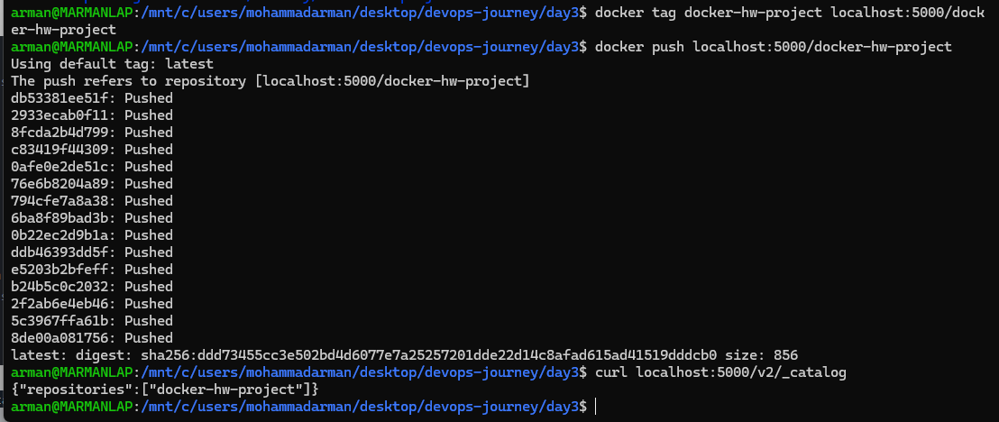
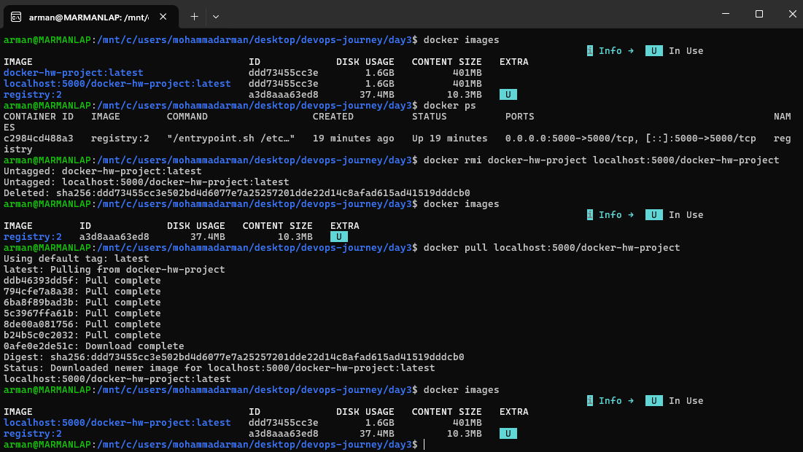
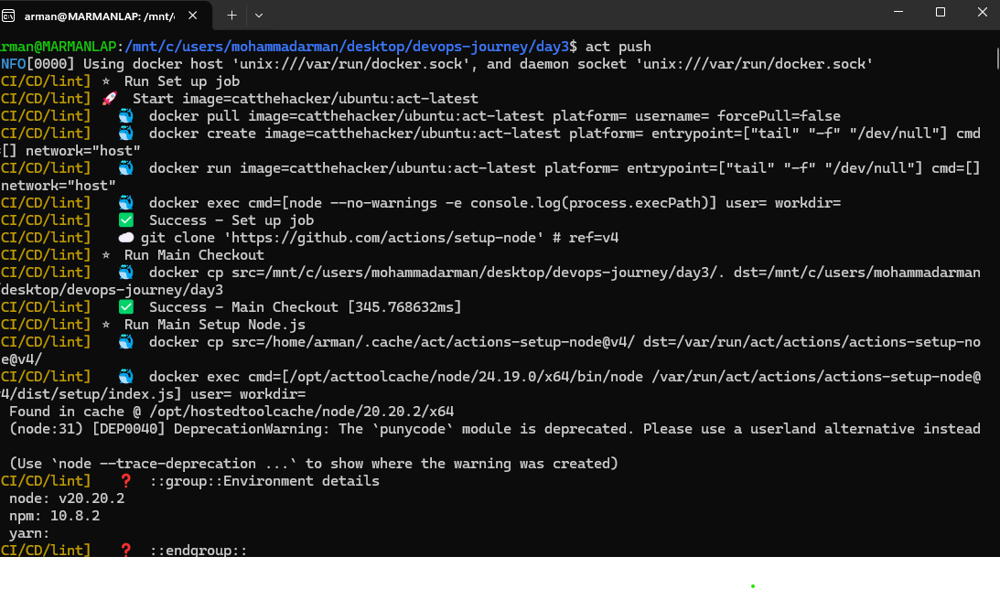
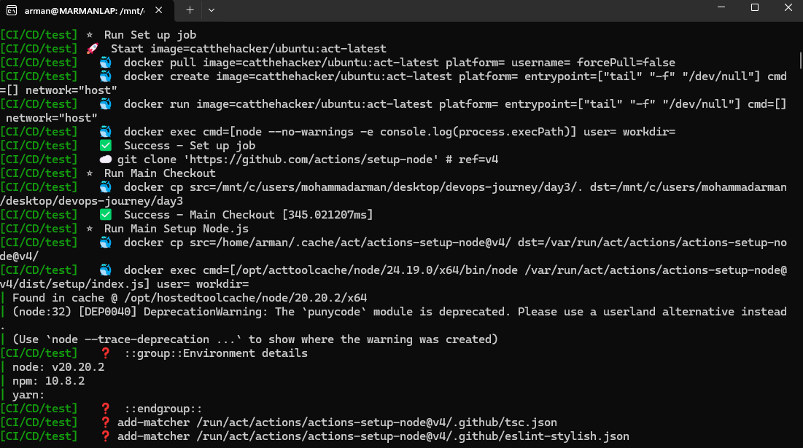
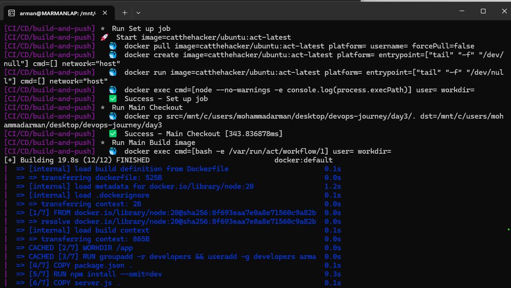
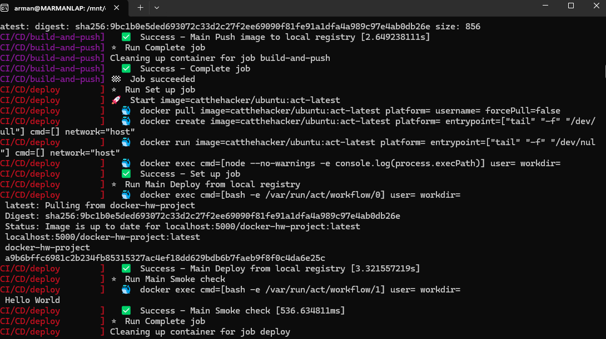

# Local Registry + CI/CD with `act`

A Node/Express Hello World app, pushed through a local Docker
registry and a full lint → test → build → push → deploy pipeline
run locally with [`act`](https://github.com/nektos/act). Screenshots
below are the actual terminal output captured while running each step.

## Files

- `server.js` — Express app; `GET /` returns `Hello World`.
- `package.json` — scripts for `start`, `lint`, and `test`.
- `.eslintrc.json` — ESLint config used by the lint job.
- `test/server.test.js` — Node test runner checks for `/` and 404.
- `Dockerfile` — single-stage image (`node:20`), runs as `armanDev`.
- `Dockerfile.multistage` — builder + `node:20-alpine` runtime.
- `.github/workflows/build-and-push.yml` — CI/CD workflow for `act`.

## Steps

### 1. Start a local registry

```bash
docker run -d -p 5000:5000 --name registry registry:2
```

Pulls `registry:2` if it is not already local, maps host `5000` to
the container, and starts it detached under the name `registry`.



### 2. Confirm the catalog is empty

```bash
curl localhost:5000/v2/_catalog
```

The Registry HTTP API responds with `{"repositories":[]}` — the
registry is up and reachable, but nothing has been pushed yet.



### 3. Build the app image

```bash
docker build -t docker-hw-project .
```

Builds from `Dockerfile`: `node:20` base, creates the `armanDev`
user, installs production deps, copies `server.js`, and exposes
port 3000.



### 4. Tag and push to the local registry

```bash
docker tag docker-hw-project localhost:5000/docker-hw-project
docker push localhost:5000/docker-hw-project
curl localhost:5000/v2/_catalog
```

Retags the image for `localhost:5000`, pushes every layer, then
re-checks the catalog — it now lists `docker-hw-project`.



### 5. Prove the registry round-trip

```bash
docker images
docker ps
docker rmi docker-hw-project localhost:5000/docker-hw-project
docker images
docker pull localhost:5000/docker-hw-project
docker images
```

After deleting both local tags, only `registry:2` remains. Pulling
`localhost:5000/docker-hw-project` restores the image from the
registry — the push was not just a local tag rename.



### 6. Run CI/CD locally — lint

```bash
act push
```

`act` simulates a GitHub Actions `push` event. The first job is
`lint`: checkout, Node 20 setup, `npm install`, then `npm run lint`.



### 7. CI/CD — test

After lint succeeds, the `test` job runs the same Node setup and
executes `npm test` (`node --test` against `test/server.test.js`).



### 8. CI/CD — build and push

```bash
# from the workflow (build-and-push job)
docker build \
  -t "localhost:5000/docker-hw-project:${GITHUB_SHA}" \
  -t "localhost:5000/docker-hw-project:latest" \
  -f Dockerfile \
  .
docker push "localhost:5000/docker-hw-project:${GITHUB_SHA}"
docker push "localhost:5000/docker-hw-project:latest"
```

Once lint and test pass, `build-and-push` builds the image tagged
with the commit SHA and `latest`, then pushes both to
`localhost:5000`.



### 9. CI/CD — deploy and smoke check

The `deploy` job pulls `localhost:5000/docker-hw-project:latest`,
replaces any existing `docker-hw-project` container, publishes port
3000, and curls `/` until it gets `Hello World`.


